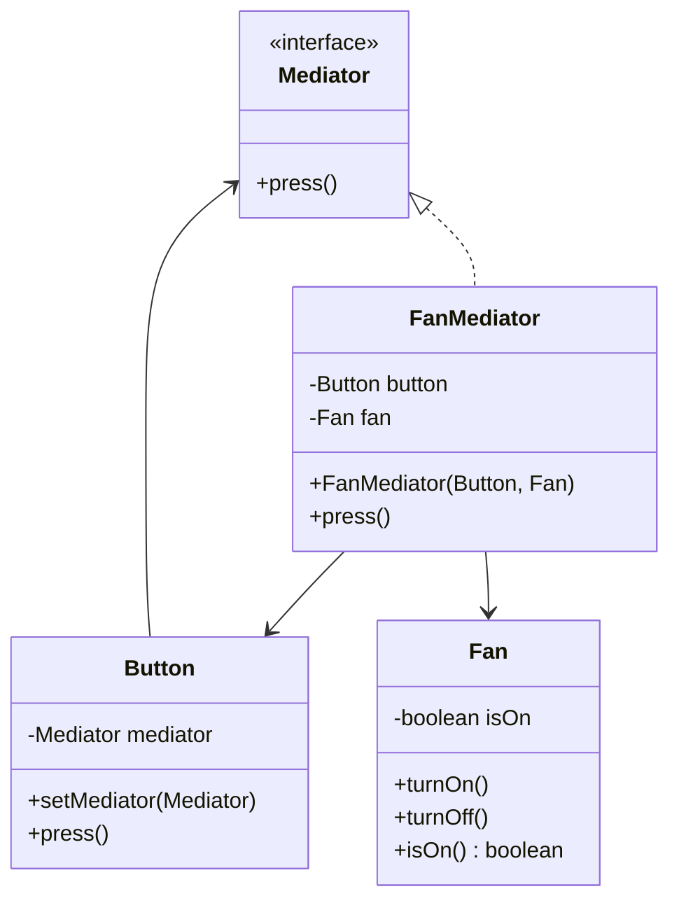

# Mediator Design Pattern

This project demonstrates the Mediator Design Pattern, which is a behavioral design pattern that allows objects to communicate with each other without having to know each other's details. This pattern promotes loose coupling by keeping objects from referring to each other explicitly.

## Overview

The Mediator pattern defines an object that encapsulates how a set of objects interact. It promotes loose coupling by preventing objects from referring to each other explicitly, allowing you to vary their interaction independently.

## Class Diagram

Below is a class diagram representing the structure of the Mediator Design Pattern in this project:

## Components

- **Mediator Interface**: Defines the method `press()` that concrete mediators must implement.
- **FanMediator**: Implements the `Mediator` interface and coordinates the interaction between the `Button` and the `Fan`.
- **Button**: Represents a UI button component that interacts with a `Mediator`. It can set a mediator and simulate a button press action.
- **Fan**: Represents a fan with basic operations to turn it on or off. It maintains an internal state to track whether the fan is on or off.

## Benefits

1. **Reduces coupling** between components of a system
2. **Centralizes control** of how components interact
3. **Simplifies object protocols** by replacing many-to-many interactions with one-to-many
4. Makes it **easier to reuse components** independently

