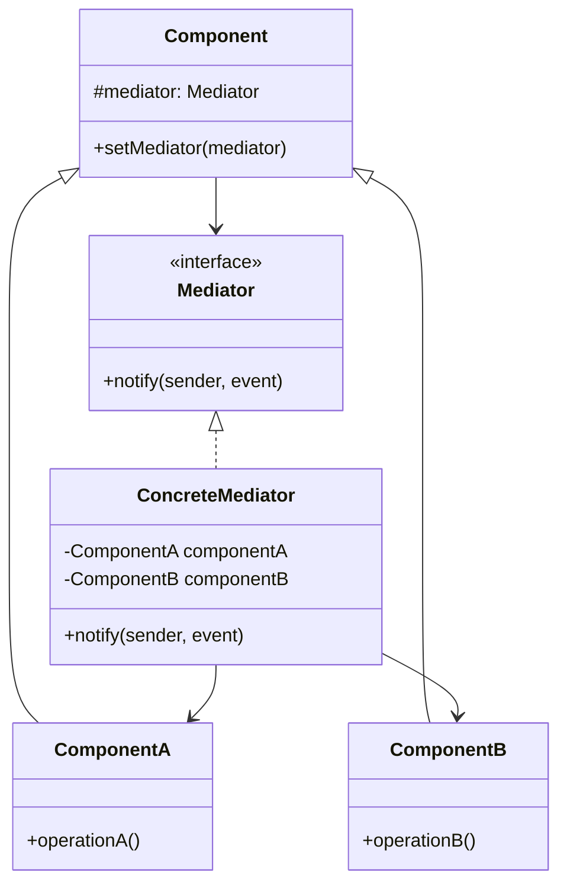

# Mediator Design Pattern

This project demonstrates the Mediator Design Pattern, which is a behavioral design pattern that allows objects to communicate with each other without having to know each other's details. This pattern promotes loose coupling by keeping objects from referring to each other explicitly.

## Overview

The Mediator pattern defines an object that encapsulates how a set of objects interact. It promotes loose coupling by preventing objects from referring to each other explicitly, allowing you to vary their interaction independently.

## Class Diagram

Below is a class diagram representing the structure of the Mediator Design Pattern:

## Components

- **Mediator Interface**: Defines the communication interface between components.
- **Concrete Mediator**: Implements the Mediator interface and coordinates between components.
- **Component**: Base class for objects that communicate through the mediator.
- **Concrete Components**: Specific components that interact with each other through the mediator.

## Benefits

1. **Reduces coupling** between components of a system
2. **Centralizes control** of how components interact
3. **Simplifies object protocols** by replacing many-to-many interactions with one-to-many
4. Makes it **easier to reuse components** independently

## Real-World Examples

- Air traffic control system where the control tower (mediator) manages communication between planes
- Chat applications where a server (mediator) manages message delivery between users
- GUI frameworks where event handlers (mediators) manage interactions between UI components

## Implementation Considerations

When implementing the Mediator pattern:
- Define a clear interface for the mediator
- Consider using events or observer pattern for notification
- Be careful not to create a "god object" mediator that knows too much

## When to Use

Use the Mediator pattern when:
- A set of objects communicate in well-defined but complex ways
- Reusing objects is difficult because they refer to many other objects
- You want to customize behavior distributed between several classes without creating subclasses

This pattern is particularly useful in complex UI interactions, workflow systems, and any scenario where multiple objects need to coordinate their behavior.
